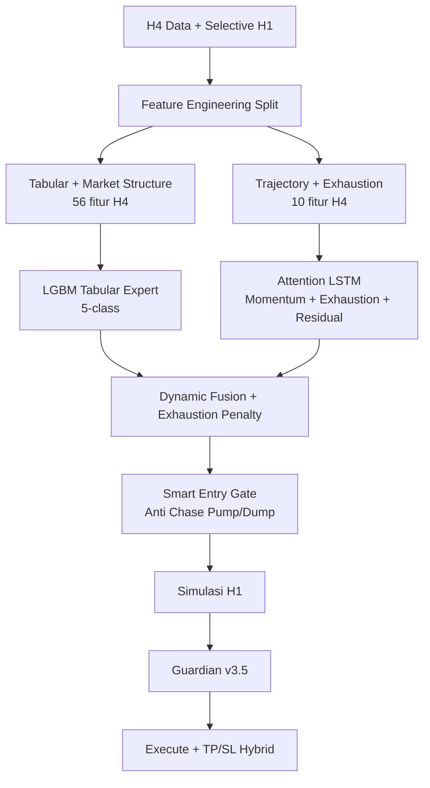

# CLAUDE.md — Cascade v5: Focused Residual + Exhaustion Hybrid (H4 Primary)

## Overview

Sistem trading kripto berbasis ML untuk Binance Futures.
Nama internal lama: *Exhaustion-Aware Residual Momentum Hybrid* — sama dengan rencana share.
Arsitektur baru yang mengatasi kelemahan utama Cascade v4:
- LGBM chase pump (masuk saat harga sudah over-extended)
- LSTM F1 ≈ random karena input fitur snapshot yang flat
- Confidence LGBM tidak terkalibrasi (loss punya conf lebih tinggi dari win)

**MODAL_PER_TRADE = 5.0 USD — MUTLAK, tidak boleh diubah**

Periode: 2020-01-01 s/d 2026-04-01.
**Timeframe: H4 PRIMARY** (model LGBM + LSTM), **H1** untuk simulasi trade + konfirmasi entry gate.
TRAIN_CUTOFF_DATE = 2025-05-01 (holdout OOS: Mei 2025 – Apr 2026)

## Rencana & Referensi (Grok Share)

Dokumen ini disinkronkan dengan percakapan rencana arsitektur:

- **Arsitektur lengkap + anti-noise + referensi GitHub (utama):** [Grok Share — Quant Trading Algorithms & GitHub Projects](https://grok.com/share/bGVnYWN5LWNvcHk_55e525f4-0219-45ca-b213-2cb8ec512b5a)
- **Penjelasan detail per model:** [Grok Share — Cascade v5 Architecture](https://grok.com/share/bGVnYWN5LWNvcHk_8697395c-f55a-47d1-81ef-e9708a33a48a)
- **Audit / legacy copy:** slug `legacy-copy` (base64 `bGVnYWN5LWNvcHk`)

Pertanyaan di share utama: *arsitektur lengkap & komprehensif — takut makin banyak fitur → noise model*.
Jawaban Grok: **Arsitektur Lengkap & Komprehensif Cascade v5** (*Focused Residual + Exhaustion Hybrid, H4 Primary*).
Isi di bawah disalin/selaras dengan teks share (bukan skor training).

## Filosofi utama

> Kita tidak ingin model yang terlalu pintar dan kompleks.  
> Kita ingin model yang lebih pintar dari LGBM lama dalam mendeteksi exhaustion,  
> tapi tetap sederhana, interpretable, dan tidak noisy.

Kita **bukan** mengganti trader yang jago baca chart — mengotomatiskan apa yang trader bagus lihat (swing, exhaustion, acceleration, structure), lalu dikombinasikan dengan ML.

## Timeframe

| TF | Peran |
|----|-------|
| **H4** | Primary — semua keputusan utama (LGBM + LSTM) |
| **H1** | Selective confirmation — timing entry saja, **bukan** input LSTM |

Tidak ada timeframe lain (tidak Daily, M15, dll.).

## Diagram alur (share rencana)



## Prinsip desain (anti-noise)

| Prinsip | Implementasi repo |
|---------|-------------------|
| Sedikit fitur, bermakna | 56 tabular H4 + 10 trajectory H4 (bukan 93+ H1 campur v4) |
| LSTM butuh variasi temporal | Hanya `LSTM_SEQUENCE_COLS`; H1 **tidak** masuk LSTM |
| Snapshot OK untuk LGBM | Tabular + OHLC di bar H4 |
| H1 = timing, bukan arah | `h1_conf.parquet` + Smart Entry Gate saja |
| Label terpisah dari TP sim | 5-class ATR-return + rule exhaustion + OOF residual |
| DROP fitur noise v4 | `DROP_FEATURES` di `config.py` |
| Metrik hanya setelah train | `EXPERIMENTS.md` + `07_holdout_backtest` |

## Model (ringkasan share)

| Model | Tipe | Tugas | Output (nama share) | Implementasi repo |
|-------|------|-------|---------------------|-------------------|
| LGBM Tabular Expert | LightGBM 5-class | Probabilitas struktur pasar | `base_long_prob`, `base_short_prob` | Collapse P(3)+P(4), P(0)+P(1) di `dynamic_fusion` |
| Momentum + Exhaustion Expert | Attention LSTM | Koreksi LGBM + exhaustion | `residual_correction`, `exhaustion_long_score`, `exhaustion_short_score` | 3 head: `residual_head`, `exhaustion_head`, `momentum_head`; label arah di `05a` (`exhaustion_long_label` / `exhaustion_short_label`) |
| Guardian v3.5 | LightGBM 3-class | Exit dinamis | HOLD / PARTIAL_EXIT / FULL_EXIT | `guardian_best.pkl` |

## Penjelasan Detail per Model

### 1. LGBM Tabular Expert (H4)

| Aspek | Nilai |
|-------|-------|
| Algoritma | LightGBM multiclass GPU (OpenCL) |
| Input | 56 fitur tabular per bar H4 (`LGBM_FEATURE_COLS`) |
| Output | 5 probabilitas kelas (index 0–4) |
| Label | ATR-normalized forward return 18 bar H4 |
| CV | 8-fold purged walk-forward, `PURGE_GAP_H4 = 6` |
| Artefak | `lgbm_tabular.pkl`, `lgbm_oof_predictions.npz` |

**Mapping kelas (training):**

| Label mentah | Index | Makna |
|--------------|-------|-------|
| -2 | 0 | Strong SHORT |
| -1 | 1 | Weak SHORT |
| 0 | 2 | FLAT |
| +1 | 3 | Weak LONG |
| +2 | 4 | Strong LONG |

**Collapse ke arah trade (fusion / simulasi):**

```
p_short = P(class 0) + P(class 1)
p_flat  = P(class 2)
p_long  = P(class 3) + P(class 4)
```

### 2. Attention LSTM — Momentum + Exhaustion Expert (H4)

| Aspek | Nilai |
|-------|-------|
| Arsitektur | 2-layer LSTM + `TemporalAttention` |
| Input | `(batch, 24, 10)` — lihat `LSTM_SEQUENCE_COLS` |
| Hidden | 128, dropout 0.3 |
| Training | DirectML GPU; inference CPU |
| Heads | 3 (regression) |

| Head | Output | Target training |
|------|--------|-----------------|
| `momentum_head` | 0–1 (sigmoid) | `momentum_label` dari 05a |
| `exhaustion_head` | 0–1 (sigmoid) | `exhaustion_label` = max(long, short) rule-based |
| `residual_head` | -1–1 (tanh) | OOF residual LGBM dari 05d |

Label arah (share): `exhaustion_long_score` / `exhaustion_short_score` di `compute_exhaustion_directional()` → kolom `exhaustion_long_label`, `exhaustion_short_label` di `05a`.

Loss: `MultiHeadLoss` — MSE momentum + MSE exhaustion + 0.5× MSE residual.

### 3. Dynamic Fusion Layer

Menggabungkan LGBM (H4, di-upsampling ke H1) + LSTM heads. Implementasi: `core/fusion.py`.

```
momentum_boost = 0.05  jika momentum_strength > 0.75, else 0

final_long  = clip(0.55 * p_long  + 0.35 * max(0, residual) - 0.25 * exhaustion + boost, 0, 1)
final_short = clip(0.55 * p_short + 0.35 * max(0, -residual) - 0.25 * exhaustion + boost, 0, 1)

direction = LONG jika final_long >= final_short, else SHORT
confidence = max(final_long, final_short)
```

### 4. Smart Entry Gate

Filter eksekusi **setelah** fusion. H4 memutuskan arah; H1 hanya konfirmasi timing.

**Normal path:** `confidence > 0.68` AND `momentum > 0.55` AND `exhaustion < 0.60`

**High-conviction path:** `momentum > 0.85` AND `exhaustion < 0.42` → `confidence > 0.60`

**H1 confirmation** (`H1_CONFIRMATION_ENABLED`):
- LONG: `h1_rsi >= 45`, `h1_log_ret_1 >= -0.5%`
- SHORT: `h1_rsi <= 55`, `h1_log_ret_1 <= +0.5%`

### 5. Guardian v3.5 (Exit Model)

| Aspek | Nilai |
|-------|-------|
| Model | LightGBM multiclass 3 kelas |
| Kelas | 0=HOLD, 1=PARTIAL_EXIT, 2=FULL_EXIT |
| Fitur statis | 56 kolom LGBM (upsample H4→H1), prefix `static_*` |
| Fitur dinamis | 9 (`GUARDIAN_DYNAMIC_FEATURES`, incl. exhaustion & momentum) |
| Simulasi label | Trade dari LGBM-only signals + `simulate_trades_swing` |

Guardian aktif di backtest jika `guardian_best.pkl` ada; memakai static matrix dari `build_guardian_static_matrix()`.

### 6. TP/SL & Simulasi

- **Resolusi simulasi:** bar H1 (`MAX_HOLDING_BARS = 24` jam)
- **TP/SL:** swing high/low H4 (ffill ke H1) + fallback ATR (`TP_SL_FALLBACK_TP/SL`)
- **Modal:** `MODAL_PER_TRADE = 5.0` USD, leverage sim 5×
- Implementasi: `core/evaluator.py::simulate_trades_swing`

## Arsitektur

```
Raw Data H1 + H4
      |
02_clean.py — H1 master + H4 master (H4 shift(1) ke H1 = anti look-ahead)
      |
03_engineer.py — Feature split
      |                    |                    |
h4_lgbm.parquet      h4_lstm.parquet      h1_conf.parquet
56 tabular H4        10 trajectory H4      3 sinyal H1 (gate saja)
+ label_lgbm 5-class + exhaustion_score
      |                    |
04_train_lgbm.py     05a labels → 05b sequences → 05d OOF residual → 05c AttentionLSTM
5-class LGBM         3 heads: momentum, exhaustion, residual
      |                    |
      +----Dynamic Fusion (H4 infer → upsample ke H1)----+
           final_long/short = 0.55*lgbm + 0.35*residual_pos
                              - 0.25*exhaustion + momentum_boost
                |
         Smart Entry Gate (H4 decision + H1 confirmation)
         final_prob > 0.68 AND momentum > 0.55 AND exhaustion < 0.60
         [High-Conviction: momentum > 0.85 → prob > 0.60]
                |
         Simulasi trade di H1 (OHLC dari processed)
                |
           Guardian v3.5 (9 dynamic features incl. exhaustion/momentum)
           HOLD / PARTIAL_EXIT / FULL_EXIT
                |
           TP/SL Hybrid (H4 Swing + ATR fallback)
```

## Perbedaan dari Cascade v4

| Aspek | Cascade v4 | Cascade v5 |
|-------|-----------|-----------|
| Timeframe model | H1 (semua fitur campur) | **H4 primary**; H1 hanya gate + simulasi |
| Entry model | LGBM H1 (93 fitur) | LGBM H4 (**56** fitur tabular, lihat `config.LGBM_FEATURE_COLS`) |
| LGBM kelas | 3-class arah | **5-class** ATR-return (strong/weak short-flat-long) |
| Sequence model | ManualLSTMCell (F1 ≈ random) | Attention LSTM + 3 output heads |
| LSTM input | Snapshot H4 flat dalam window | **10 trajectory features H4** (bukan 20 fitur H1 v4) |
| Sequence length | 32 bar H1 | **24 bar H4** (= 4 hari konteks) |
| Fusion | Scalar hard_consensus | Dynamic weighted fusion |
| Exhaustion | Tidak ada | Rule-based score + penalty di fusion |
| Modal per trade | $100 | **$5 (mutlak)** |
| Label | Forward scan TP/SL (circular) | ATR-return 5-class + OOF residual + rule exhaustion |

## Fitur (fokus kualitas, bukan kuantitas)

**Total ~66 fitur** (56 + 10) — target share ±70, bukan ratusan.

Semua daftar fitur **harus sama persis** dengan `config.py`.

### Grup 1 — Tabular + market structure (56 fitur H4) → LGBM

Kategori (lihat `LGBM_FEATURE_COLS`):
- Liquidation distances (`dist_liq_*`)
- Macro: `fear_greed`, `btc_dominance`
- H4 structure: `atr_percent_h4`, CVD/OBI, `H4_structure_break_strength`
- Price levels: PDH/PDL/PWH/PWL, swing distances
- Volume profile: POC, VAH, VAL
- OI & funding
- ATR stats, EMA slow, `log_ret_20`, `cvd`
- Structure: `bars_since_BOS`, `absorption_at_swing`
- OHLC snapshot + volume/liquidity tabular

Training & inference: **bar H4**. Untuk backtest/guardian, proba/fitur di-**upsample** ke grid H1 (`pipeline/shared.py`).

**Daftar lengkap 56 fitur** (`config.LGBM_FEATURE_COLS`):

```
dist_liq_50x_long, dist_liq_50x_short, dist_liq_20x_long, dist_liq_20x_short,
fear_greed, btc_dominance,
atr_percent_h4, cvd_slope_h4, ofi_h4_delta, trend_strength, trend_accel_4h,
cvd_momentum_adv, range_expansion_h4, cvd_div_h4, H4_structure_break_strength,
dist_from_8h_high, dist_swing_high, dist_swing_low, PDH, PDL, PWH, PWL,
POC, VAH, VAL, Buy_Liq, Sell_Liq,
open_interest, funding_rate, funding_price_div,
atr_14_h1, atr_14_h4, atr_zscore_20d, atr_percentile_h1,
ema_200_h1, ema_50_h4, ema_200_h4, log_ret_20, cvd,
dow_sin, dow_cos, bars_since_BOS, absorption_at_swing,
vwdp_smooth, relative_strength_z, whale_retail_divergence,
relative_strength_momentum, vol_spike_zscore, spread_to_volume,
vol_efficiency, buy_volume, volume,
open, high, low, close
```

### Grup 2 — Trajectory + exhaustion (10 fitur H4) → LSTM

Inti anti chase pump/dump. Didefinisikan di `LSTM_SEQUENCE_COLS` — `core/features.py::compute_trajectory_features`:

```
distance_from_recent_swing_high_atr
distance_from_recent_swing_low_atr
run_length_up_bars
acceleration_sign_change
log_return_acceleration_5
momentum_delta_5
funding_extreme_zscore
price_funding_divergence
volume_acceleration
candle_body_size_acceleration
```

Sequence: **24 bar H4** (`LSTM_SEQ_LEN`). Input shape: `(N, 24, 10)`.

**Prinsip fitur (share):** lebih sedikit tapi relevan; mirip price action trader (swing, exhaustion, acceleration, structure).

### Swing high / low

Rencana share memakai `center=True` + `right=5` (contoh pseudocode) — **berpotensi look-ahead**.

Implementasi repo (`compute_swing_levels`): **hanya backward** `SWING_LEFT_BARS=5`, tanpa right bars — aman untuk live/backtest.

### Audit v4 (referensi desain saja)

Cascade v4 mengaudit ~20 fitur H1 dengan kriteria temporal variance (fitur harus
berubah antar bar). v5 **tidak** memakai daftar 20 itu; input LSTM = 10 trajectory H4
di atas. **Tidak ada angka performa model** di dokumen ini sampai run training +
`07_holdout_backtest` (catat di `EXPERIMENTS.md`).

### H1 Confirmation (Smart Entry Gate only)

`H1_CONFIRMATION_COLS`: `h1_rsi`, `h1_log_ret_1`, `h1_accel_sign` — **bukan** input LGBM/LSTM.

### DROP (tidak dipakai)

`FVG_up`, `FVG_down`, `dynamic_position_pressure`, `hidden_divergence`, `sell_volume`

## Labeling (horizon 18 bar H4)

### LGBM — 5-class ATR (`compute_lgbm_labels_h4`)

```python
future_return_atr = (close.shift(-18) / close - 1) / atr_14
# |ret| > 2.5 ATR -> strong; |ret| > 1.0 -> weak; else flat
# Map: -2,-1,0,+1,+2 -> index 0..4
```

Hanya `shift(-horizon)` pada **label**, bukan fitur input.

### LSTM — 3 target

| Target | Cara hitung |
|--------|-------------|
| `residual_correction` | OOF: nilai kelas LGBM - probabilitas OOF (`05d`) |
| `exhaustion_long_score` | `dist_swing_high > 3.5 ATR` + accel sign negatif |
| `exhaustion_short_score` | `dist_swing_low > 3.5 ATR` + accel sign positif |
| `exhaustion_label` (train head) | `max(long, short)` + rule tambahan di `compute_exhaustion_score` untuk engineer |

### Mitigasi noise & overfitting (share)

- Feature split ketat (LGBM vs LSTM)
- Hanya 10 fitur trajectory untuk LSTM
- Exhaustion penalty di fusion (`FUSION_EXHAUSTION_PENALTY`)
- Walk-forward purged CV (`N_FOLDS=8`, holdout OOS pasca `TRAIN_CUTOFF_DATE`)
- Regularisasi: LSTM dropout 0.3, weight decay, early stopping; LGBM early stopping 50

## Label Strategy (Anti-Leakage) — detail

### Masalah v4: Circular Leakage

```
Label: "did price reach TP in next 24 bars?" — forward scan
Model: belajar prediksi label
Backtest: evaluasi dengan TP/SL yang sama
Result: WR tinggi by construction, bukan generalisasi
```

### Solusi v5: 3 Label Terpisah

**1. LGBM Label (5-class, H4)** — `compute_lgbm_labels_h4` di `core/features.py`

- Horizon: 18 bar H4 (~3 hari)
- `future_return_atr = (close[t+h]/close[t] - 1) / ATR[t]`
- Classes: -2 strong short, -1 weak short, 0 flat, +1 weak long, +2 strong long
- Threshold: strong `|ret| > 2.5 ATR`, weak `|ret| > 1.0 ATR`
- Purged CV: `PURGE_GAP_H4 = 6` (1 hari), boundary cutoff: `PURGE_GAP_BARS = 24` H1

**2. Exhaustion Label** — rule-based, backward-only (`compute_exhaustion_score`)

Skor 0–1 dari 4 sinyal (bukan single forward-scan TP):
- Over-extended: `|distance_from_swing| > 3.5 ATR` (`EXHAUSTION_SWING_ATR_THR`)
- Volume melemah: ratio < 0.7 (`EXHAUSTION_VOL_DROP`)
- Rejection wick > 50% (`EXHAUSTION_WICK_RATIO`)
- Acceleration sign change

**3. Residual Correction Label** — OOF stacking (`05d_oof_residuals.py`)

```
Stage 1: Train LGBM purged CV → lgbm_oof_predictions.npz
Stage 2: residual = class_value(y_true) - sum(oof_proba * CLASS_VALUES)
         LSTM residual head dilatih pada endpoint sequence H4 (bar_indices)
```

**Momentum label** (`05a`): regresi 0–1 dari price acceleration + volume confirmation (backward-only).

**Direction label** (Guardian/training aux): 3-class SHORT/FLAT/LONG untuk simulasi.

Fusion & simulasi trade memakai **3-class** hasil collapse: `p_short = P(0)+P(1)`, `p_long = P(3)+P(4)`, `p_flat = P(2)`.

## Pipeline

```
01_fetch.py            → H1 + H4 klines, funding, OI, macro
02_clean.py            → {symbol}_h1_clean.parquet, {symbol}_h4_clean.parquet
03_engineer.py         → {symbol}_h4_lgbm.parquet  (LGBM + label_lgbm)
                       → {symbol}_h4_lstm.parquet  (10 trajectory + exhaustion_score)
                       → {symbol}_h1_conf.parquet   (3 kolom gate)
                       [--holdout] → data/holdout/labeled/
04_train_lgbm.py       → lgbm_tabular.pkl, lgbm_oof_predictions.npz
05a_momentum_labels.py → {symbol}_momentum_labels.parquet
05b_build_sequences.py → {symbol}_sequences.npz (N, 24, 10)
05d_oof_residuals.py   → update residual_labels di sequences.npz (setelah 04)
05c_train_momentum_expert.py → lstm_momentum_expert.pt, lstm_seq_scaler.pkl
06_train_guardian.py   → guardian_best.pkl (LGBM infer H4, sim H1)
07_holdout_backtest.py → models/runs/{run_id}/holdout_*
```

Urutan wajib: `04` → `05a` → `05b` → `05d` → `05c` → `06` → `07`.

Holdout: jalankan `01`–`03` dengan `--holdout`, lalu `07`.

### Perintah eksekusi (training penuh)

```powershell
cd cascade-v5-architecture
python pipeline/01_fetch.py --all
python pipeline/02_clean.py --all
python pipeline/03_engineer.py --all
python pipeline/04_train_lgbm.py --all
python pipeline/05a_momentum_labels.py --all
python pipeline/05b_build_sequences.py --all
python pipeline/05d_oof_residuals.py --all
python pipeline/05c_train_momentum_expert.py --all
python pipeline/06_train_guardian.py --all
python pipeline/07_holdout_backtest.py --all
```

Holdout data: ulangi `01`–`03` dengan `--holdout`, lalu `07`.

## Stack & Referensi GitHub (Quant ML)

Sesuai share [55e525f4](https://grok.com/share/bGVnYWN5LWNvcHk_55e525f4-0219-45ca-b213-2cb8ec512b5a) — **referensi pola**, bukan dependency wajib semua:

| Komponen | Library / Proyek | Status di repo |
|----------|------------------|----------------|
| Gradient boosting | [LightGBM](https://github.com/microsoft/LightGBM) | **Dipakai** — LGBM Expert + Guardian |
| Deep learning | [PyTorch](https://github.com/pytorch/pytorch) | **Dipakai** — AttentionLSTM |
| GPU Windows | [torch-directml](https://github.com/microsoft/DirectML) | **Dipakai** — training LSTM (RX 6600) |
| Financial ML / purged CV | [mlfinlab](https://github.com/hudson-and-thames/mlfinlab) | Pola CV — implementasi custom di `pipeline/shared.py` |
| Backtest vektor (referensi) | [vectorbt](https://github.com/polakowo/vectorbt) | Tidak dipakai; simulasi custom `core/evaluator.py` |
| Backtest event-driven (referensi) | [backtrader](https://github.com/mementum/backtrader) | Tidak dipakai |
| RL trading (referensi) | [FinRL](https://github.com/AI4Finance-Foundation/FinRL) | Tidak dipakai — supervised hybrid |
| Exchange API (alternatif) | [ccxt](https://github.com/ccxt/ccxt) | Tidak dipakai — REST Binance di `01_fetch.py` |
| Data | `requests` + Binance Futures REST | **Dipakai** |
| Tabular IO | PyArrow / Parquet | **Dipakai** |

Pola desain dari literatur quant open-source:
- **Purged CV / anti-leakage** — mirip mlfinlab / Lopez de Prado (`PURGE_GAP_H4`, `PURGE_GAP_BARS`)
- **OOF stacking** — residual head LSTM pada error OOF LGBM (`05d_oof_residuals.py`)
- **Regime + structure** — liquidation, swing, volume profile (bukan raw OHLC saja)

## Key Files

| File | Role |
|------|------|
| `config.py` | Source of truth semua parameter |
| `core/features.py` | Feature engineering (LGBM + LSTM + H1 conf + labels) |
| `core/models.py` | AttentionLSTM + 3 heads |
| `core/fusion.py` | Dynamic Fusion + Smart Entry Gate (+ H1 confirmation) |
| `core/evaluator.py` | `simulate_trades_swing` + Guardian (9 dynamic feat) |
| `pipeline/shared.py` | Purged folds, `load_coin_simulation_data`, upsample H4→H1 |
| `tools/benchmark_plan.py` | Audit repo vs rencana ini |

## Data Layout

```
data/
  raw/           # output 01_fetch
  processed/     # output 02_clean (*_h1_clean, *_h4_clean)
  labeled/       # output 03_engineer (*_h4_lgbm, *_h4_lstm, *_h1_conf)
  sequences/     # output 05a/05b (*_sequences.npz)
  holdout/       # mirror struktur untuk OOS
models/
  lgbm_tabular.pkl
  lgbm_oof_predictions.npz
  lstm_momentum_expert.pt
  lstm_seq_scaler.pkl
  guardian_best.pkl
  guardian_scaler.pkl
  guardian_feature_cols.json
  runs/{run_id}/  # output 07
```

## Constraints

- Python 3.12, Windows, AMD RX 6600 (DirectML)
- Shell: PowerShell (chain dengan `;`)
- Encoding terminal: cp1252 — hindari unicode di logger
- LGBM: `device_type="gpu"` OpenCL
- LSTM: train DirectML (`core/utils.py::get_lstm_device`), infer CPU
- MODAL_PER_TRADE = 5.0 — tidak boleh diubah
- TRAIN_CUTOFF_DATE = 2025-05-01 — tidak boleh bocor ke training

## Verifikasi keselarasan

```powershell
python tools/benchmark_plan.py
```

- PASS/FAIL/WARN/SKIP = checklist struktur (file, import, path) — **tanpa skor %**
- Metrik model (F1, WR, PF) hanya setelah training + `07_holdout_backtest` → `EXPERIMENTS.md`

Target: FAIL=0 pada struktur/import/path; SKIP normal jika data belum di-fetch.

## Google Colab

Skrip Jupyter: `notebooks/cascade_v5_jupyter.py` · notebook: `Cascade_v5_Jupyter.ipynb` · panduan: `notebooks/README.md`

```text
Runtime GPU → upload/clone repo → setup_colab() → pipeline 01–07 (pilot 3 koin dulu)
```

Set `CASCADE_COLAB=1` atau `tools.colab_bootstrap.setup_colab()` — LGBM CPU, LSTM CUDA.

## Deteksi overfitting

Setelah training (`04`–`06`) dan opsional holdout (`07`):

```powershell
python tools/overfitting_report.py
python tools/overfitting_report.py --holdout-run models/runs/holdout_YYYYMMDD_HHMMSS
```

Output: `reports/overfitting_*.md` + `.json`. Template: `reports/TEMPLATE_overfitting.md`.

Sinyal: stabilitas CV, gap train/val, OOF vs in-sample log-loss, kalibrasi confidence, holdout WR vs proxy CV.
Ambang di `config.py` (`OVERFIT_*`).

## Experiments Log

Lihat `EXPERIMENTS.md` untuk catatan hasil per run.